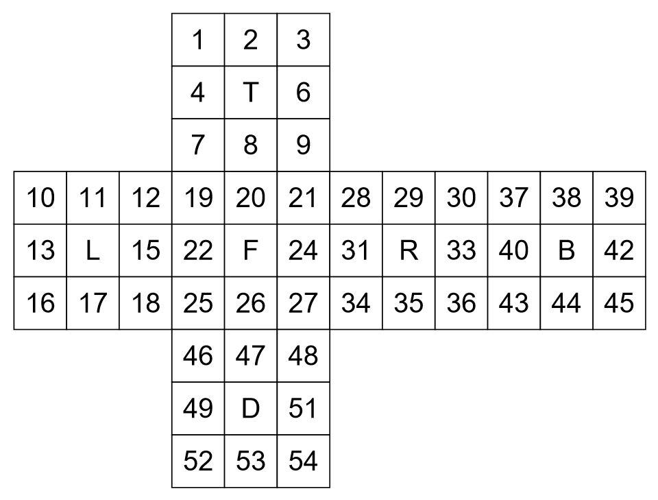

# Rubik’s Cube Solver And Visualization


## Intro

- This repository maintains codes for solving a certain **3-order Rubik’s Cube**, with two versions based on **Mathematica** and **Python** respectively.

- The visualization for solution steps are provided as well.

- The main idea of solution is not based on traditional 3-order Rubik's Cube formulas, but the algorithm to **decompose a group element into a product of group generators**.
> Python version is still in progress, since the `sympy` lib cannot solve the `generator_list` efficiently.


## Main Idea of Solving

Each three-order Rubik’s Cube can be flattened as following:



- T - Top, L - Left, F - Front, R - Right, B - Behind, D - Down

- The indices of center faces are covered by face identifiers. T - 5, L -14, F - 23, R - 32, B - 41, D - 50

- Each state of a Rubik’s Cube can be regarded as a permutation of the integers. A state is valid if and only if it can be converted to the original state after finite operations, i.e. its permutation is an element of the Rubik’s Group.

- For the diagram above, use the face identifiers to represent the 90 degree rotation of corresponding face. The group generators of Rubik's Group can be written as:

```
T = ((1, 3, 9, 7) (2, 6, 8, 4) (10, 37, 28, 19) (11, 38, 29, 20) (12, 39, 30, 21)),
L = ((1, 19, 46, 45) (4, 22, 49, 42) (7, 25, 52, 39) (10, 12, 18, 16) (11, 15, 17, 13)), 
F = ((7, 28, 48, 18) (8, 31, 47, 15) (9, 34, 46, 12) (19, 21, 27, 25) (20, 24, 26, 22)), 
R = ((3, 43, 48, 21) (6, 40, 51, 24) (9, 37, 54, 27) (28, 30, 36, 34) (29, 33, 35, 31)), 
B = ((1, 16, 54, 30) (2, 13, 53, 33) (3, 10, 52, 36) (37, 39, 45, 43) (38, 42, 44, 40)), 
D = ((16, 25, 34, 43) (17, 26, 35, 44) (18, 27, 36, 45) (46, 48, 54, 52) (47, 51, 53, 49))
```


- The solution is a sequence of generators represented as operation identifiers. With the permutation of the given state obtained, we can represent this inverse permutation as a product of group generators, i.e. a sequence of rotations on different faces.
- In Mathematica, [**GroupElementToWord**](https://reference.wolfram.com/language/ref/GroupElementToWord.html.en) is used to convert the permutation to product of generators.
- In Python, [sympy.combinatorics.perm_groups.PermutationGroup.generator_product](https://docs.sympy.org/latest/modules/combinatorics/perm_groups.html#sympy.combinatorics.perm_groups.PermutationGroup.generator_product) is used to convert the permutation to product of generators. But it is very much slow if `original` is set `True`, which is required in this case.


